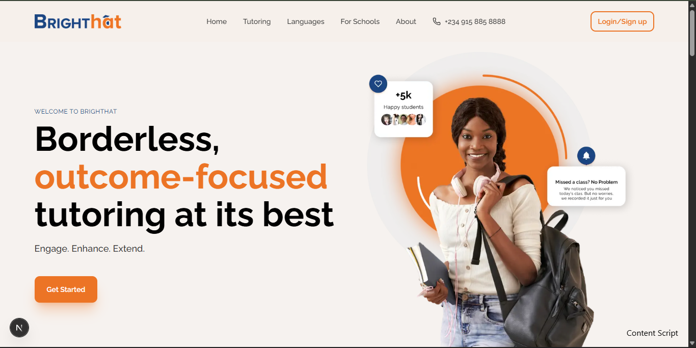

🎓 BrightHat | Borderless Tutoring Platform

A high-performance, responsive EdTech landing page engineered with Next.js, TypeScript, and Tailwind CSS v4.

(Note: Replace preview-image.png with a screenshot of your finished Hero section)

🚀 Overview

BrightHat is a modern tutoring platform designed to connect students with expert educators. This project is a pixel-perfect implementation of the design system, focusing on outcome-focused UI, interactive user flows, and scalable component architecture.

The goal was not just to build a static page, but to create a maintainable, data-driven application that scales easily as the business grows.

🛠️ Tech Stack & Tools

Framework: Next.js 15 (App Router) - For server-side rendering and SEO optimization.

Language: TypeScript - For strict type safety and robust code quality.

Styling: Tailwind CSS v4 - Using the latest CSS-first configuration and CSS variables.

Icons: Lucide React - Lightweight, consistent SVG icons.

Fonts: Raleway - Optimized via next/font/google to prevent layout shift.

✨ Key Features

1. 🎨 Advanced UI Implementations

Pop-out Avatar Effects: The Tutors section features a complex CSS layering technique where images extend beyond their bounding circles (z-index manipulation) for a dynamic 3D feel.

CSS Masking: Icons in the "What We Offer" section use mask-image to dynamically recolor SVGs via code, removing the need for duplicate asset exports.

Glassmorphism & Gradients: The Navbar features a backdrop-blur effect, and the Footer utilizes ambient background glows using pure CSS radial gradients.

2. ⚡ Interactivity & State

Master-Detail Testimonials: A state-driven layout where clicking a user profile instantly updates the review content without a page reload.

Native Scroll Carousel: The Products section uses CSS Scroll Snapping (snap-x) for buttery-smooth horizontal scrolling on mobile, controlled programmatically via useRef on desktop.

Multi-Step Form Logic: The Tutoring form handles selection state (useState) with visual feedback loops for active/inactive states.

3. 🏗️ Scalable Architecture

Data-Driven UI: All textual content (Tutors, Pricing, Features) is extracted into src/constants/index.ts. This acts as a "Headless CMS," allowing non-developers to update content without touching JSX.

Atomic Design: Reusable primitives like Button.tsx and Container.tsx ensure global consistency in padding, border-radius (10px), and hover states.

📂 Project Structure

A professional, feature-folder based architecture:

src/
├── app/ # Next.js App Router
│ ├── layout.tsx # Global Font & SEO Configuration
│ ├── page.tsx # Homepage Assembly
│ └── tutoring/ # Tutoring Services Page
├── components/
│ ├── ui/ # Atomic Components (Button, Container)
│ ├── layout/ # Global Structure (Navbar, Footer)
│ └── pages/ # Page-Specific Sections
│ ├── home/ # Hero, Testimonials, Products
│ └── tutoring/ # Form, Pricing, Offerings
├── constants/ # The Source of Truth (Data Arrays)
├── public/ # Static Assets (Optimized Images/SVGs)
└── styles/ # Global CSS & Tailwind Theme

🔧 Getting Started

Follow these steps to run the project locally:

1. Clone the repository
   git clone https://github.com/your-username/brighthat.git
   cd brighthat

2. Install dependencies
   npm install

3. Run the development server
   npm run dev

4. View the application
   Open http://localhost:3000 in your browser.

🧠 Architectural Decisions (Why I did this?)

Tailwind v4 over v3: I opted for v4 to utilize the new CSS-first configuration (@theme). This keeps the build lighter and aligns with modern web standards, removing the need for a heavy JavaScript config file.

Next/Image: All images utilize Next.js optimization. This prevents Layout Shifts (CLS) and automatically serves WebP formats for faster load times on mobile networks.

Component Composition: The "Value Proposition" section uses a layered background approach (absolute positioning with z-index) to achieve the overlapping card effect seen in the Figma file, ensuring the layout remains fluid across screen sizes.
